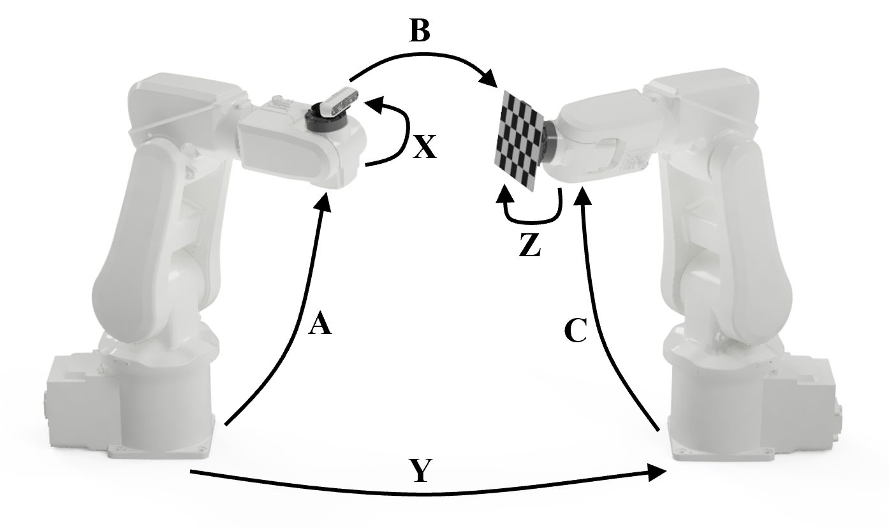

# AXB = YCZ Calibration
AXB = YCZ extrinsic camera calibration of dual-arm robot using probabilistic methods. 



## Taxonomy

Knowns:

A - Transformation from base link to end effector of robot 1
B - Transformation from camera to calibration board
C - Transformation from base link to end effector of robot 2

Uknowns:

X - Transformation from end-effector to camera
Y - Transformation from base link of robot 1 to base link of robot 2
Z - Transformation from end-effector to calibration board

Calibration board - ChArUco 

## Repository Structure

The repository is organized into the following directories:

```
  ├── main/
  │    └─ Contains the main scripts for running the calibration method.
  ├── utils/
  │    └─ Contains helper functions used throughout the calibration process.
  ├── solvers/
  │    └─ Contains the core solvers for the probabilistic methods.
  ├── data/
  │    └─ Contains the input data, including the transformation matrices for the robot arms.
  └── results/
       └─ Stores the output text files containing the results of the calibration process and plots.
```

## Getting Started

```
# Clone the repository to your local machine:
git clone git@github.com:RMDLO/axbycz_calibration.git

# Navigate to the main directory:
cd axbycz_calibration/main

# CMakeLists.txt update the following lines:
set(axbycz_calibration /path/to/axbycz_calibration)
include_directories(/path/to/axbycz_calibration/util)
include_directories(/path/to/axbycz_calibration/solvers)

# Compile and run the main script:
g++ -o main_script mainRealData.cpp -O3 -std=c++17 -I/path/to/eigen
./mainRealData

# Replace /path/to/eigen with the path to the Eigen library on your system
```

## Dependencies

- **Eigen**


The original MATLAB implementation can be found here: https://github.com/ruansp/axbycz_calibration

### Cite:
```
@article{ma2018probabilistic,
  title={Probabilistic approaches to the AXB= YCZ AXB= YCZ calibration problem in multi-robot systems},
  author={Ma, Qianli and Goh, Zachariah and Ruan, Sipu and Chirikjian, Gregory S},
  journal={Autonomous Robots},
  volume={42},
  pages={1497--1520},
  year={2018},
  publisher={Springer}
}
```

## License

This project is licensed under the MIT License.